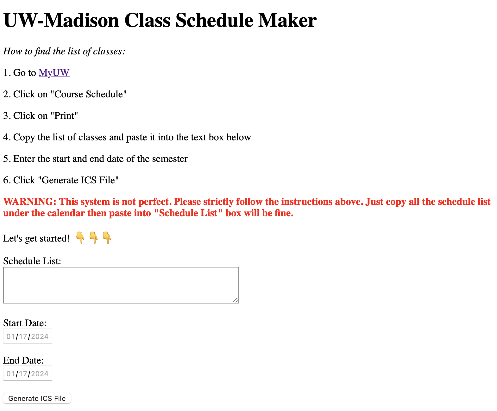

# MadCal: "Class Schedule" Calendar Generator
No more manually entering all your classes into your calendar!

This is a one-stop tool for UW-Madison students making their class schedule. Follow the below steps to automatically create a file with all your classes which can be uploaded to Google Calendar or Outlook!

This project is open source. There is also local Python Script version.

## How to use
1. Go to your [MyUW](https://my.wisc.edu/web/expanded)
2. Click on "Course Schedule"
3. Select the correct Term
4. Scroll down, and copy the entire list of Courses (everything below the calendar view) and paste it into the text box below
5. Enter the start and end date of the semester
6. Click "Generate ICS File"

Just as simple as that!😼

## User Tips
- This web app is designed for UW-Madison students, so it only supports UW-Madison course schedule format.
- The format is sensitive, so please make sure you copy the schedule list correctly. (Make sure to copy the entire schedule list under the calendar then paste into the "Schedule List" box.)
- Please double check the start and end time of your class is correct (end time should be later than start time!!). If not, the event will have no week repeat.

## About Authors
- Created by *Alex Holland* and *Zhenzhao Tu* 🤓
- If you are interested in how this site was developed, check out [Zhenzhao's website](https://math.tuzhenzhao.com) 📒
- Feel free to contact us if you have any questions or suggestions. Email [here](tuzhenzhao@gmail.com) 📧

☕️ If this site was helpful, please consider  

Not Affiliated with UW-Madison
