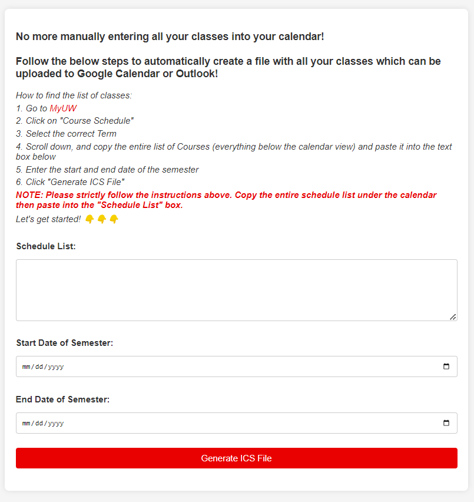

# Schedule Auto Converter UW-Madison
This is a one stop web project for UW-Madison students making their class schedule. Copy your schedule list then paste it into the text box, then you can get the `.ics` ready for you to import into your calendar.

This project is open source. There is also local Python Script version.

## How to use
1. Go to your [MyUW](https://my.wisc.edu/web/expanded)
2. Click on **Course Schedule**
3. Click on **Print** button
4. Copy the class schedule list under the calendar chart
5. Paste it into the text box
6. Click on **Generate ICS File** button
7. Import the `.ics` file into your calendar

Just as simple as that!😼

## User Tips
- This web app is designed for UW-Madison students, so it only supports UW-Madison course schedule format.
- The format is sensitive, so please make sure you copy the schedule list correctly. (Make sure include the weekdays in the schedule list)
- Please double check the start and end time of your class is correct (end time should be later than start time!!). If not, the event will have no week repeat.

## About Author
- Created by *Zhenzhao Tu* 🤓
- If you are interested the how to develop this small web, check out my [website](https://math.tuzhenzhao.com) 📒
- Feel free to contact me if you have any questions or suggestions. My email is [here](tuzhenzhao@gmail.com) 📧

☕️ If you think it is helpful, please consider buying me a coffee  
